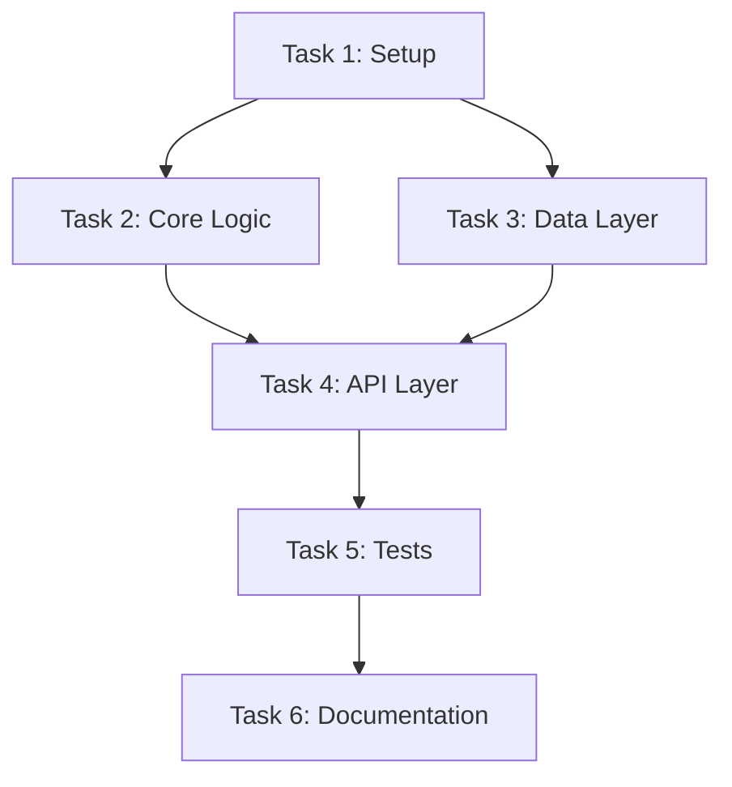

# AxiomOS: Standard Development Mode - SDM-RFC Protocol

## Overview

The **Standard Operating Procedure** for all complex development tasks, transforming intent into a production-grade asset through six quality-gated phases.

## Protocol

`<protocol name="Standard Development Mode - SDM-RFC">`

### Phase 1: Scope

**Goal:** Transform vague intent into a structured, bounded task scope.

**Execution:**

1. **`Chain-of-Thought`:** Parse the instruction, identify potential ambiguities.
   - Example: For "add user login," consider:
     - Login types (email/username/social)
     - Session management (JWT/session cookies)
     - Lockout policies
     - Password requirements
     - 2FA requirements
   - List clarification questions

2. **Clarification & RFC Draft:** Ask precise questions and, based on answers, generate a draft `RFC_[task_name].md` with:
   - `Overview`
   - `Goals`
   - `Non-Goals`
   - `Acceptance Criteria`

**Quality Gate:** User must provide preliminary confirmation of `Goals` and `Non-Goals`.

---

### Phase 2: Architect

**Goal:** Design a complete, executable technical solution.

**Execution:**

1. **`Chain-of-Thought`:** Request and analyze `.agents/context/` content.
   - Devise at least two alternative solutions
   - Compare them on multiple dimensions:
     - Cost (development + maintenance)
     - Complexity
     - Security
     - Performance
     - Scalability
   - Select the optimal one based on project principles
   - Consider impacts on existing modules
   - Activate `Ultrathink` if highly complex

2. **RFC Completion:** Complete all RFC sections:
   - `Proposed Solution` (with diagrams)
   - `Technical Design`
   - `API Specifications`
   - `Data Model Changes`
   - `Security Considerations`
   - `Performance Impact`
   - `Alternatives Considered`
   - `Implementation Plan`
   - `Testing Strategy`
   - `Rollout Plan`
   - `Monitoring & Observability`

**Quality Gate:** Architecture must adhere to `.agents/context/` principles; interface definitions must be complete.

---

### Phase 3: Atomize

**Goal:** Decompose the RFC solution into independent, verifiable, atomic tasks.

**Execution:**

1. **`Chain-of-Thought`:** Read the RFC's `Proposed Solution`:
   - Identify functional module dependencies
   - Order them as a Directed Acyclic Graph (DAG)
   - Prevent conflicts through proper sequencing
   - Ensure each task is:
     - Independent (or clearly dependent)
     - Testable
     - Completable in one session
     - Has clear acceptance criteria

2. **Generate Task List:** Create `TASK_[task_name].md` with:
   - Ordered task list with numbers
   - Dependencies clearly marked
   - Acceptance criteria for each task
   - Verification commands
   - Mermaid diagram of dependencies:



**Quality Gate:** The sum of atomic tasks must cover all RFC requirements; the dependency graph must have no circular dependencies.

---

### Phase 4: Approve

**Goal:** Obtain the user's final, **contractual authorization** before automated execution.

**Execution:**

1. **Submit for Review:** Formally submit RFC and TASK documents, stating:

   > **The RFC is the sole source of truth and an insurmountable boundary for all subsequent automated execution. Your approval signifies signing this contract.**

2. **Await Authorization:** Wait for the user's explicit "approve" or "proceed" instruction.

**Quality Gate:** The core hard gate of **Specification-Driven Development**.

**Important:** No code generation happens until this approval is received.

---

### Phase 5: Automate

**Goal:** Efficiently generate high-quality, production-grade code based on the signed contract.

**Execution:**

1. **Ordered Execution:** Strictly follow the task dependency graph from Phase 3.

2. **Test-First Implementation:** For each task, follow this sequence:
   - **Step 1:** Generate interfaces/types (contracts)
   - **Step 2:** Write failing tests that validate contracts
   - **Step 3:** Write implementation code
   - **Step 4:** Run tests until all pass
   - **Step 5:** Self-check and refactor for quality
   - **Step 6:** Move to next task

3. **Adherence to Standards:** Every line of code **must** comply with **Production-Grade Deliverable Standards**:
   - Domain alignment
   - Zero-trust security
   - Reliability & resilience
   - Observability
   - Testability (>95% coverage)
   - Performance & efficiency
   - Maintainability
   - No placeholders
   - Existing patterns
   - Scoped changes
   - Cross-platform compatibility

4. **Progress Reporting:** Report completion of each task:
   ```yaml
   Task Progress:
     Completed: Task 3 of 6
     Current: Implementing API layer
     Status: Tests passing (42/42)
     Coverage: 97.3%
   ```

**Quality Gate:** All generated code must pass 100% of tests; no placeholders allowed.

---

### Phase 6: Assess

**Goal:** Final validation and knowledge consolidation.

**Execution:**

1. **Overall Acceptance:** Run all tests to verify functionality against RFC acceptance criteria:
   - Unit tests: All passing
   - Integration tests: All passing
   - E2E tests: Critical paths verified
   - Performance tests: Meets requirements
   - Security tests: No vulnerabilities

2. **`Chain-of-Thought`:** Review the task process:
   - What worked well?
   - What was challenging?
   - Were there deviations from the RFC? Why?
   - New design patterns identified?
   - Architectural decisions made?
   - Domain model clarifications needed?
   - Performance considerations discovered?

3. **Propose `.agents/context/` Update:** Proactively propose updating `.agents/context/` with refined knowledge assets:
   - New patterns discovered
   - Architecture decisions
   - Domain model updates
   - Security learnings
   - Performance insights

**Quality Gate:** Deliverable must 100% meet acceptance criteria; generated core knowledge must be proposed for consolidation into `.agents/context/`.

`</protocol>`

## SDM Workflow Diagram

```
┌─────────────────────────────────────────────────────────┐
│                     PHASE 1: SCOPE                       │
│  Transform vague intent → Structured scope              │
│  Output: RFC Draft (Overview, Goals, Non-Goals)         │
└──────────────────┬──────────────────────────────────────┘
                   │ User confirms Goals/Non-Goals
                   ▼
┌─────────────────────────────────────────────────────────┐
│                   PHASE 2: ARCHITECT                     │
│  Design complete solution with alternatives             │
│  Output: Complete RFC with technical design             │
└──────────────────┬──────────────────────────────────────┘
                   │ Architecture approved
                   ▼
┌─────────────────────────────────────────────────────────┐
│                    PHASE 3: ATOMIZE                      │
│  Break down into atomic tasks with DAG                  │
│  Output: TASK document with dependencies                │
└──────────────────┬──────────────────────────────────────┘
                   │ Tasks verified
                   ▼
┌─────────────────────────────────────────────────────────┐
│                    PHASE 4: APPROVE                      │
│  ⚠️  CRITICAL QUALITY GATE                              │
│  User signs the contract                                │
└──────────────────┬──────────────────────────────────────┘
                   │ APPROVED ✓
                   ▼
┌─────────────────────────────────────────────────────────┐
│                   PHASE 5: AUTOMATE                      │
│  Test-first implementation of all tasks                 │
│  Output: Production-grade code + tests                  │
└──────────────────┬──────────────────────────────────────┘
                   │ All tests passing
                   ▼
┌─────────────────────────────────────────────────────────┐
│                    PHASE 6: ASSESS                       │
│  Validation + Knowledge consolidation                   │
│  Output: Verified deliverable + .agents/context/ proposals │
└─────────────────────────────────────────────────────────┘
```

## Usage Examples

### Example 1: Adding Authentication

**Phase 1 - Scope:**
```markdown
# RFC: Add User Authentication

## Overview
Implement JWT-based authentication for the API

## Goals
- Secure endpoints with JWT tokens
- Support login/logout
- Token refresh mechanism

## Non-Goals
- OAuth integration (future phase)
- 2FA (future phase)
```

**Phase 2 - Architect:**
- Design JWT flow
- Define API endpoints
- Security considerations
- Data model for tokens

**Phase 3 - Atomize:**
1. Create User model
2. Implement JWT service
3. Create login endpoint
4. Create logout endpoint
5. Add authentication middleware
6. Write tests

**Phase 4 - Approve:**
User reviews and approves RFC + TASK

**Phase 5 - Automate:**
Implement each task in order with tests

**Phase 6 - Assess:**
Verify all works, propose security patterns to `.agents/context/`

## Best Practices

### For Each Phase

**Scope:**
- Ask specific, targeted questions
- Avoid assumptions
- Be explicit about boundaries

**Architect:**
- Consider at least 2 alternatives
- Use diagrams liberally
- Think about non-functional requirements

**Atomize:**
- Each task should be <4 hours
- Clear dependencies
- Testable outcomes

**Approve:**
- Don't rush this gate
- Ensure user understands scope
- Confirm resource availability

**Automate:**
- Test-first always
- Commit after each task
- Keep code reviews in mind

**Assess:**
- Be honest about deviations
- Capture learnings
- Update documentation

## Anti-Patterns

Avoid these common mistakes:

❌ **Skipping Scope**: Jumping to implementation without clarification
❌ **Single Solution**: Not considering alternatives in Architect phase
❌ **Large Tasks**: Tasks that take >4 hours to complete
❌ **Premature Coding**: Starting Automate before Approve
❌ **Ignoring Tests**: Writing code without tests
❌ **Forgetting Assessment**: Not capturing learnings

## Related Modules

- [Core Principles](../foundation/principles.md) - Specification-Driven Development
- [Deliverable Standards](../standards/deliverable.md) - Quality requirements
- [Context Protocol](../foundation/context.md) - .agents/context/ usage
- [Ultrathink Protocol](../cognitive/ultrathink.md) - Complex problem solving
