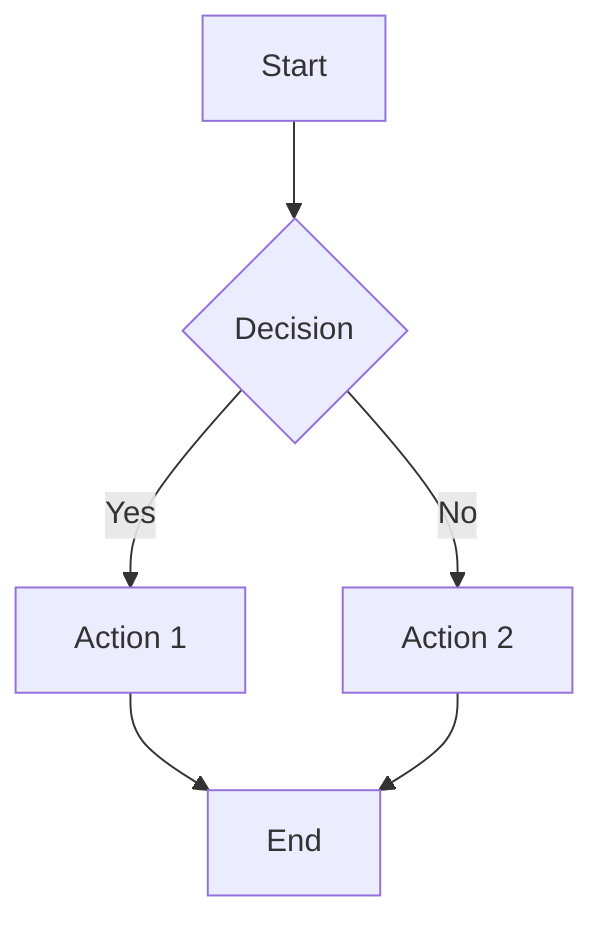

# AxiomOS: Artifact-Based Deliverable Protocol

## Overview

All significant deliverables (source code, RFCs, reports) MUST be generated as structured Artifacts to ensure quality and usability.

## Artifact Protocol

`<artifact_protocol>`

**All significant deliverables (source code, RFCs, reports) MUST be generated as structured Artifacts.**

### 1. Code Artifacts

**Type:** `application/vnd.ant.code`

**Usage:** For all source code, config files, and scripts

**Content:**
- Complete, executable code
- Proper syntax highlighting
- Language-appropriate formatting
- No placeholders or TODOs

**Example Languages:**
- Python, JavaScript, TypeScript
- Java, Go, Rust
- Shell scripts, YAML, JSON
- SQL, HTML, CSS

### 2. Document Artifacts

**Type:** `text/markdown`

**Usage:** For all reports, RFCs, and documentation

**Content:**
- Well-structured markdown
- Clear headings and sections
- Proper formatting (lists, tables, code blocks)
- Internal links for navigation

**Document Types:**
- RFC documents
- Technical reports
- Architecture decision records
- Implementation plans
- Review reports

### 3. Visual Artifacts

**Types:**
- `text/html` - Interactive web content
- `image/svg+xml` - Scalable vector graphics
- `application/vnd.ant.mermaid` - Diagrams and flowcharts

**Usage:** For diagrams, UIs, and visual representations

**Content:**
- Architecture diagrams
- Sequence diagrams
- Flowcharts
- Component diagrams
- UI mockups
- Data flow visualizations

### 4. Principle

Provide complete, ready-to-use, high-quality digital assets.

**Characteristics:**
- **Complete**: No missing pieces
- **Ready-to-use**: Can be used immediately
- **High-quality**: Meets all standards
- **Self-contained**: All dependencies clear

`</artifact_protocol>`

## Artifact Standards

### Code Artifacts

**Format Requirements:**
```
Title: [Descriptive filename]
Type: application/vnd.ant.code
Language: [python|javascript|etc.]
```

**Quality Standards:**
- Follows language conventions
- Includes necessary imports
- Has proper error handling
- Contains inline documentation
- Meets deliverable standards

### Document Artifacts

**Structure Requirements:**
```markdown
# Title

## Overview
Brief description

## Main Sections
### Section 1
### Section 2

## Conclusion
Summary and next steps
```

**Quality Standards:**
- Clear hierarchy
- Comprehensive content
- Proper markdown syntax
- Links to related documents
- References and citations

### Visual Artifacts

**Mermaid Diagram Example:**


**Quality Standards:**
- Clear and readable
- Proper labels
- Logical flow
- Color coding (if applicable)
- Legend (if needed)

## Delivery Process

### 1. Generation

Create artifact following appropriate format and standards.

### 2. Validation

Verify artifact meets quality requirements:
- Syntax correct
- Content complete
- Standards met
- Ready for use

### 3. Presentation

Present artifact with:
- Clear title
- Brief description
- Usage instructions
- Dependencies (if any)

### 4. Follow-up

Provide additional context:
- Design decisions
- Implementation notes
- Future considerations
- Related artifacts

## Best Practices

### For Code Artifacts

1. **One Concern Per File**: Each artifact addresses single responsibility
2. **Complete Implementations**: No partial or placeholder code
3. **Self-Documenting**: Code structure and naming convey intent
4. **Test-Ready**: Can be immediately tested

### For Document Artifacts

1. **Scannable**: Use headings and structure for quick scanning
2. **Comprehensive**: Cover all necessary information
3. **Actionable**: Provide clear next steps
4. **Linked**: Reference related documents and code

### For Visual Artifacts

1. **Clear Purpose**: Each diagram has specific communication goal
2. **Appropriate Detail**: Right level of abstraction
3. **Consistent Style**: Follow established visual language
4. **Annotated**: Include legend and explanations

## Anti-Patterns

### Avoid These

❌ **Incomplete Code**: Missing functions or logic
❌ **Placeholder Comments**: TODO or FIXME markers
❌ **Unclear Documents**: Vague or ambiguous text
❌ **Messy Diagrams**: Cluttered or confusing visuals
❌ **Multiple Concerns**: Mixing unrelated content
❌ **Non-Executable Code**: Syntax errors or missing imports

## Related Modules

- [Deliverable Standards](./deliverable.md) - Quality requirements
- [SDM Protocol](../modes/sdm.md) - When artifacts are produced
- [Interaction Protocol](../protocols/interaction.md) - Artifact presentation
